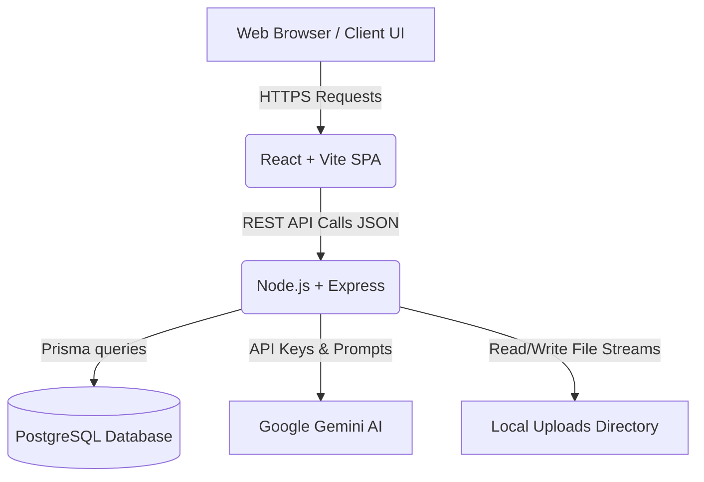
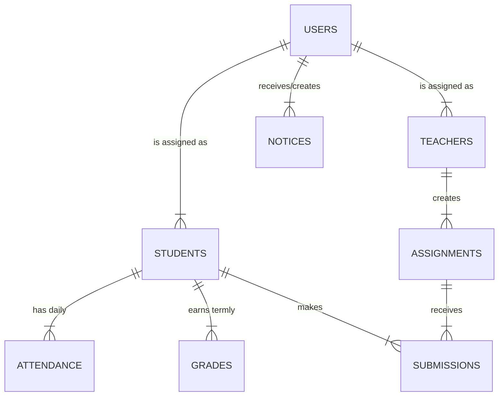
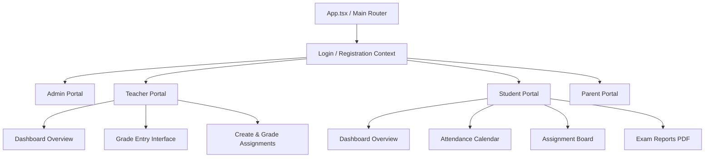
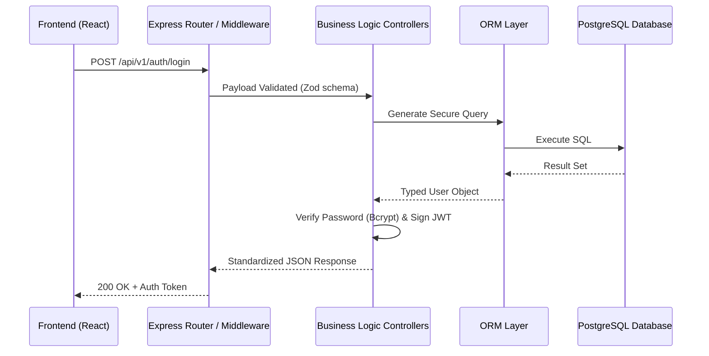

# Charronix School Management System: Comprehensive Project Report

## 1. Scope of the Project
The Charronix School Management System is a modern, AI-enhanced centralized platform designed to digitalize and streamline all administrative, academic, and communication processes within an educational institution. The scope encompasses the development of four distinct portals (Admin, Teacher, Student, Parent) accessible via a single responsive web interface. It aims to replace disparate, legacy, paper-based systems with a unified, cloud-ready solution powered by a React frontend, Node.js/Express backend, and PostgreSQL database. Integration with Google's Gemini AI provides advanced capabilities such as automated insights and an active AI assistant, significantly reducing manual administrative overhead and improving data-driven decision-making.

## 2. Module Descriptions
1. **User Management & Authentication Module**: Ensures secure login, stateless session management via JWT, and granular Role-Based Access Control (RBAC). It guarantees that Admin, Teacher, Student, and Parent data remains isolated and strictly protected according to their permission levels.
2. **Academic & Examination Management Module**: Handles comprehensive grade entry workflows, automated GPA and percentage calculations, and dynamic PDF generation (via jsPDF) of term-wise report cards. It completely digitizes the traditional mark sheet.
3. **Attendance Tracking & Analytics Module**: Facilitates daily attendance marking with real-time percentage tracking. It includes automatic warnings for low attendance (e.g., dropping below the 75% threshold) and visualizes data using interactive charts (Recharts).
4. **Assignment Integration Module**: Enables teachers to securely upload assignments, worksheets, and study materials. Students can download these documents, complete them, and submit their solutions digitally. Includes multi-stage status tracking (Pending, Submitted, Graded) and file storage management.
5. **Timetable & Scheduling Module**: Generates automatic schedule grids based on teacher availability, classes, and subjects. The resulting conflict-free timetable is easily readable by all relevant roles in their respective portals.
6. **Notice & Notification Center Module**: Acts as a centralized digital communication hub spanning across all portals. Notices are categorized by importance (Urgent, Academic, Event) and targeted at specific user roles, fully replacing physical notice boards.
7. **AI Insights & Assistant Module**: Integrates the Google Gemini AI to analyze raw school data (e.g., highlighting performance trends or attendance risks) and provides a conversational interface for users to receive immediate, contextual support regarding school operations.

## 3. Proposed System Architecture (High-Level overview)
The proposed system architecture is a decoupled, modern 3-tier RESTful API architecture:
- **Presentation Layer (Frontend)**: A React + Vite Single Page Application (SPA) styled with Tailwind CSS, rendering dynamic, role-specific dashboard views.
- **Application Layer (Backend)**: Node.js with Express acting as the core API gateway. This layer handles stringent business logic, request validation (Zod), rate limiting, file upload processing (Multer), and orchestration of AI prompts.
- **Data Layer (Database)**: An interconnected PostgreSQL relational database explicitly managed through the Prisma ORM to guarantee type safety, reliable schema migrations, and referential integrity across complex datasets like grades and attendance.

## 4. System Architecture Diagrams

### 4.1 Overall High-Level System Architecture


### 4.2 Database Entity-Relationship Architecture


### 4.3 Frontend Component Architecture


### 4.4 API Data Flow Architecture


### 4.5 AI Integration Architecture
```mermaid
graph LR
    User[User interacting with UI] -->|Types Query| Frontend
    Frontend -->|Sends context + Query| AIPoint[Express AI Controller]
    AIPoint -->|System Snapshot Builder| Context[Generate Live DB Context String]
    Context -->|Prompt + Data Injection| SDK[@google/genai SDK]
    SDK -->|Encrypted HTTPS| GeminiCloud[Gemini 3 Flash Model]
    GeminiCloud -->|Markdown Response| SDK
    SDK -->|Sanitize & Format| Frontend
```

## 5. Objectives in Detail for All Portals

### 🏢 Admin Portal
- **Objective**: Maintain total overarching control of the institution's operations, user base, structural configurations, and system health.
- **Key Functions**: Hire and manage teaching staff, handle bulk student admissions, define global system parameters (e.g., minimum attendance thresholds, academic years), monitor system security, and view holistic school-wide analytics and audit logs.

### 👨‍🏫 Teacher Portal
- **Objective**: Empower educators with efficient digital tools to streamline daily classroom administrative tasks and academic evaluation, reducing paperwork.
- **Key Functions**: Mark daily attendance with rapid-entry interfaces, grade ongoing assignments and final term exams, track subject-level cohort progress, and communicate specific notices to their assigned classes.

### 🎓 Student Portal
- **Objective**: Provide students with a transparent, engaging, and mobile-friendly interface to track their own academic journey and institutional responsibilities.
- **Key Functions**: Monitor personal attendance percentages to actively avoid falling below required thresholds, view and download upcoming assignments, upload completed homework submissions, access term report cards, and interact with the AI assistant for contextual study help mapping.

### 👨‍👩‍👦 Parent Portal
- **Objective**: Bridge the communication gap between the school and home environments by providing parents with real-time, unfiltered visibility into their child's daily school life and progress.
- **Key Functions**: View the exact, up-to-date academic grades and attendance history of their specific child without waiting for end-of-term meetings, receive urgent administrative notices instantly, and review achievements to monitor for needed academic interventions early.

## 6. Literature Survey

### Traditional School Management Systems vs. Cloud-Native SaaS
Historically, school management relied heavily on localized ERP systems (e.g., legacy versions of SIMS or specialized, rigid desktop applications). These legacy systems typically suffered from high on-premise infrastructure maintenance costs, distinct lack of remote accessibility for students/parents, and slow upgrade cycles. The modern software paradigm explicitly emphasizes Cloud-Native web applications that provide real-time, zero-install data access across consumer devices. Charronix aligns with this shift, providing broad accessibility without heavy local requirements.

### The Role of Integrated AI in EdTech Operations
Recent academic and industry literature highlights a significant shift from "passive data storage" to "active analytical assistance" in educational technology. Standard Learning Management Systems (LMS) like Moodle and Canvas are increasingly adopting predictive analytics. However, the deep integration of advanced Large Language Models (LLMs) like Google Gemini into core ERP systems—as done in Charronix—represents the cutting edge of this evolution. This moves the system beyond static dashboards and standard reports to conversational AI that can interpret holistic student data (combining both grades and attendance contexts) to suggest personalized behavioral interventions or simply answer complex data inquiries on demand.

### Architectural Shifts in Education Delivery (Next-Gen Stacks)
The widespread adoption of React combined with Node.js and a strongly-typed ORM like Prisma (a variation of the modern PERN stack utilized in Charronix) addresses specific historical bottlenecks in educational databases, specifically N+1 query problems and massive concurrent traffic. As noted in modern software engineering literature, utilizing decoupled RESTful Application Programming Interfaces (APIs) paired with stateless token-based authentication (JSON Web Tokens) provides the only viable, scalable architecture to handle extreme usage spikes—such as thousands of students logging in concurrently during exam result publication days—without system degradation.
